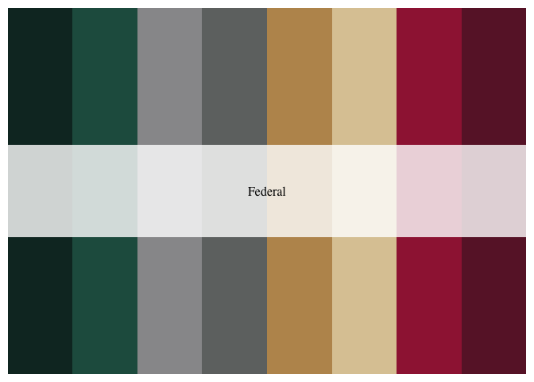

<!-- README.md is generated from README.Rmd. Please edit that file -->

# gobmx

<!-- badges: start -->
<!-- badges: end -->

Paleta de colores asociadas a instituciones del Gobierno de México. Es
una copia de la de
[`Wes Anderson`](https://github.com/karthik/wesanderson) pero con los
colores institucionales vigentes en 2021. **NO ES UN PRODUCTO OFICIAL**.

## Instalación

Puedes instalar desde Github haciendo

`{r. eval = FALSE} devtools::install_github("RodrigoZepeda/gobmx")`

para llamarla a tu sesión actual:

``` r
library(gobmx)
```

## Ejemplo

La paleta funciona mediante `gobmx_palette` donde puedes especificar si
deseas una paleta discreta (en general tienen pocos colores excepto
`Federal` y `CDMX2`) o bien una continua que interpola valores entre
dichos colores. Las paletas disponibles son las siguientes:

``` r
names(gobmx_palettes)
#> [1] "Federal"      "FederalLight" "FederalDark"  "IMSS"         "CDMX1"       
#> [6] "CDMX2"
```

``` r
library(gobmx)
## basic example code
```

# Gobierno Federal

``` r
gobmx_palette("Federal")
```



# Gobierno Federal (sólo tonos oscuros)

``` r
gobmx_palette("FederalDark")
```


