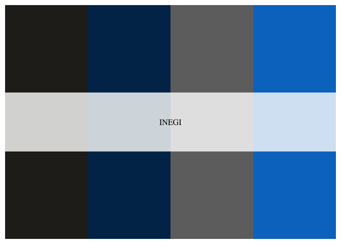
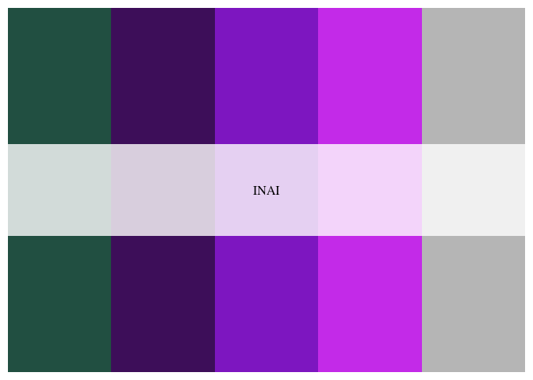
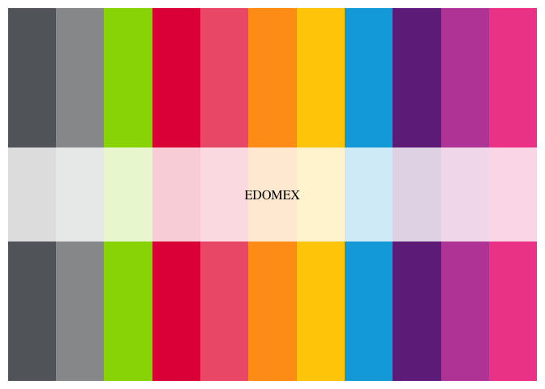

<!-- README.md is generated from README.Rmd. Please edit that file -->

# gobmx

<!-- badges: start -->
<!-- badges: end -->

Paleta de colores asociadas a instituciones del Gobierno de México. Es
una copia de la de
[`Wes Anderson`](https://github.com/karthik/wesanderson) pero con los
colores institucionales vigentes en 2021. **NO ES UN PRODUCTO OFICIAL**.

## Instalación

Puedes instalar desde Github haciendo

``` r
devtools::install_github("RodrigoZepeda/gobmx")
```

para llamarla a tu sesión actual:

``` r
library(gobmx)
```

## Ejemplo

La paleta funciona mediante `gobmx_palette` donde puedes especificar si
deseas una paleta discreta (en general tienen pocos colores excepto
`Federal` y `CDMX2`) o bien una continua que interpola valores entre
dichos colores. Las paletas disponibles son las siguientes:

``` r
names(gobmx_palettes)
#> [1] "Federal"      "FederalLight" "FederalDark"  "IMSS"         "CONEVAL"     
#> [6] "INAI"         "CDMX1"        "CDMX2"
```

``` r
library(gobmx)
## basic example code
```

# Gobierno Federal

``` r
gobmx_palette("Federal")
```


# Gobierno Federal (sólo tonos oscuros)

``` r
gobmx_palette("FederalDark")
```


# Gobierno Federal (sólo tonos claros)

``` r
gobmx_palette("FederalLight")
```


# IMSS

``` r
gobmx_palette("IMSS")
```


# CDMX 1

``` r
gobmx_palette("CDMX1")
```


# CDMX 2

``` r
gobmx_palette("CDMX2")
```


# INAI

``` r
gobmx_palette("INAI")
```



# CONEVAL

``` r
gobmx_palette("CONEVAL")
```



# Ejemplos

``` r
library(ggplot2)
pal   <- gobmx_palette("FederalLight", 32, type = "continuous")
datos <- data.frame(y = rnorm(32), Estado = as.factor(1:32))
ggplot(datos, aes(x = Estado, y = y)) +
  geom_col(aes(fill = Estado)) +
  scale_fill_manual(values = pal) +
  theme_classic() +
  theme(legend.position = "none")
```


``` r
pal   <- gobmx_palette("CDMX2", 32, type = "continuous")
datos <- data.frame(y = rnorm(32), Estado = as.factor(1:32))
ggplot(faithfuld, aes(waiting, eruptions)) +
  geom_raster(aes(fill = density)) +
  scale_fill_gradientn(colours = pal) +
  theme_void()
```



# Colabora

Si tu institución favorita no está aquí, siempre puedes agregarla ya sea
a través de un `pull request` o bien si no sabes cómo, escríbeme en
Twitter \[@RodZepeda\](<https://twitter.com/RodZepeda>)
